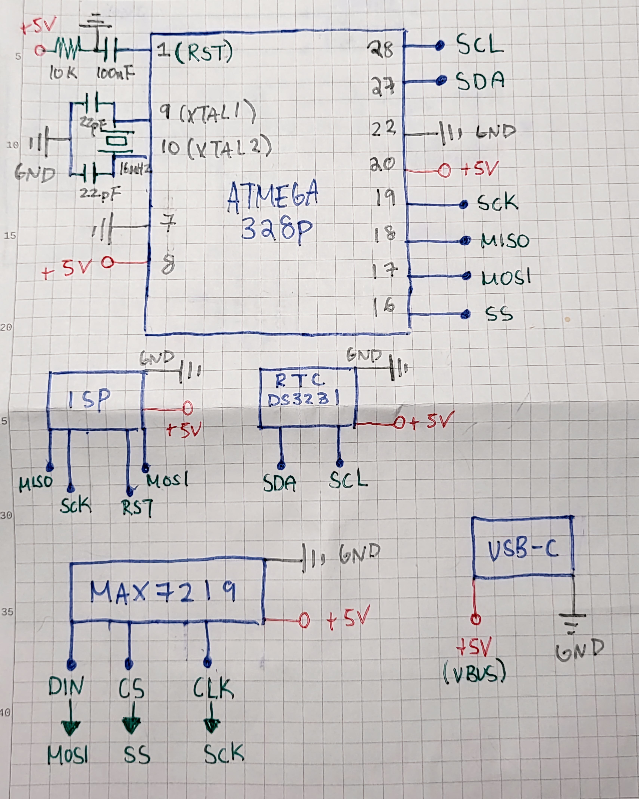

# AVR Simple Clock

An experiment using chained LED matrices with an ATMega328P

## Hardware
* ATmega328P @ 16 MHz
* 6x - MAX7219
* DS3231 RTC Module

### Unused 
* HC-05 BLE Module

This was connected to its UART pins. Meant to retrieve data from the buffer in the format of: **HH:MM:SS:AM_or_PM**, spliced, and update the display. More information is shown in **main.c**

I've attempted to use push buttons instead, but there was unusual issues with the buttons not registering when pressed.

## Software
* [MAX7219 Library](https://github.com/eziya/AVR_MAX7219_MATRIX/tree/master)
* [RTC Library](https://github.com/akafugu/ds_rtc_lib)

## Resource
* [ISP Circuit](https://www.kanda.com/avr-isp-circuits.html)
  
## Schematic

Although uncompleted in a way, I felt this project needed to stop here. As there is much I needed to learn about the AVR microcontrollers. 
